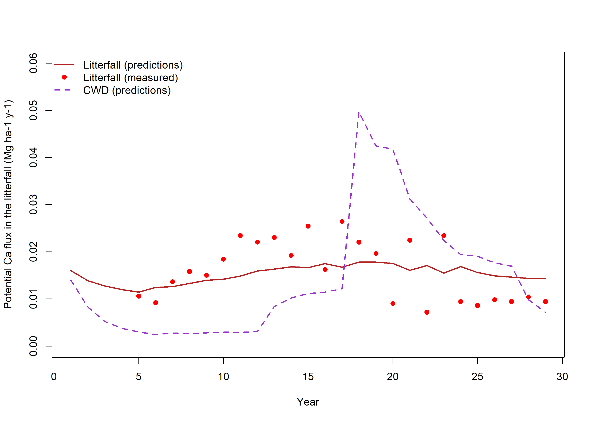
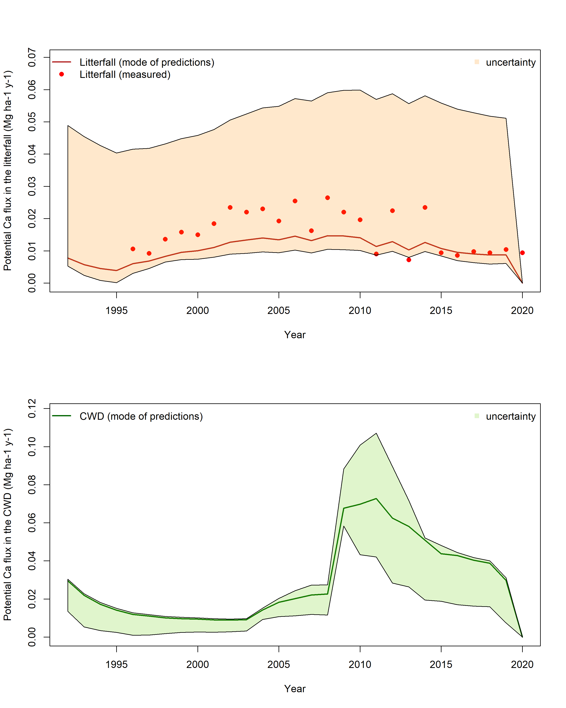
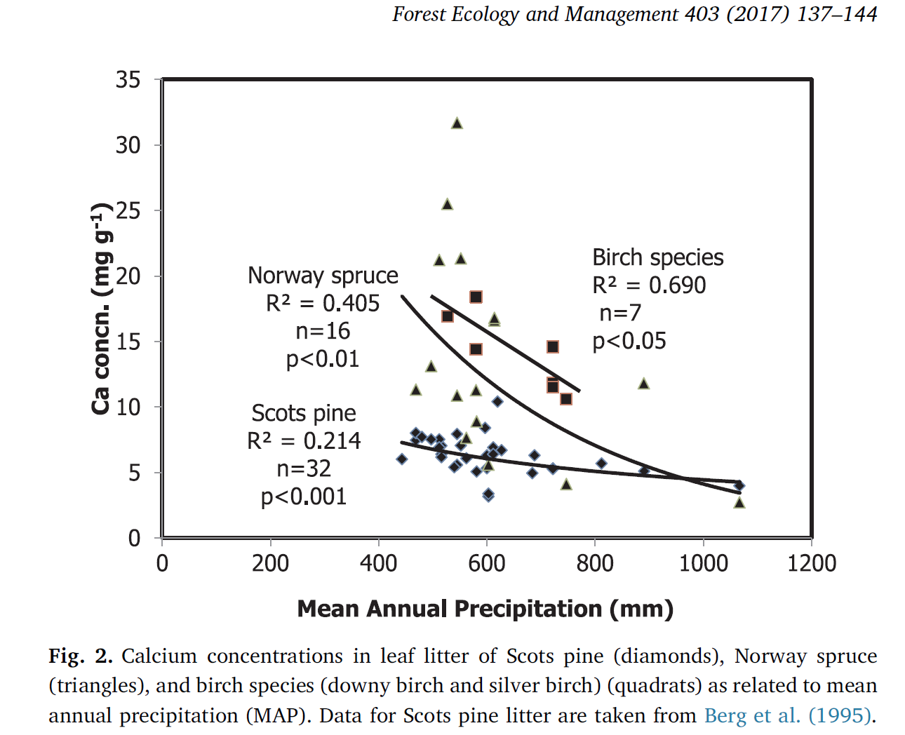
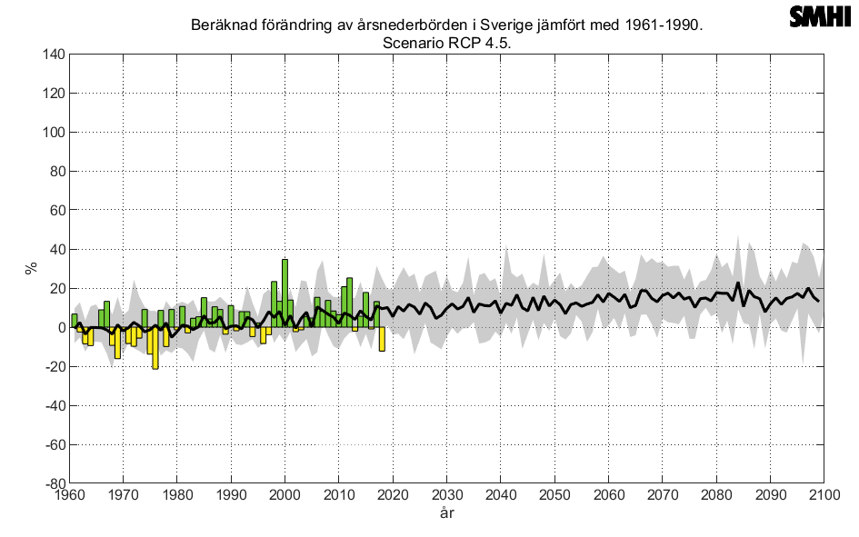

```{r setup, include=FALSE}
knitr::opts_chunk$set(echo = TRUE)
```

# 0 Starting point
The Q model in its former calibration [@hyvonenPredictingLongTermSoil1998] can represent relatively well the litterfall Ca^++^ fluxes, as in this draft simulation:

The model is driven by littertrap data and by assumptions about CWD data. 

# 1 Extending Q to predict potential Ca^++^ mineralization with uncertainty

# 1.2 Uncertainty implementation

We can consider the uncertainty of the model predictions by extending forward the uncertainty estimated for Q previously estimated (**Ecosphere publication, accepted. Put reference as soon as it's published**). Such calibration produced a set of possible parameter values within a certain confidence interval of predictions (based on the calibration decomposition dataset of the study), and we can assume that the parameter uncertainty will be the same in this case. We can therefore run multiple iterations of the model using the former calibration parameter sets to produce margins of uncertainty.
The terms u0 and tmax are calculated, with an error term added from the model calibration. The maximum tree diameter has been assumed as 13.5 centimeters, from the average of the dataset of the model calibration [@makinenPREDICTINGDECOMPOSITIONSCOTS2006]. The term u0 is calculated from latitude according to @hyvonenPredictingLongTermSoil1998 based on the relationship $u0=0.0855+0.0157*(50.6-0.768*latitude)$. Error terms to these values are added based on the model calibration in (**Ecosphere publication, accepted. Put reference as soon as it's published**).



The model is run considering only priors from the former calibration, without updating them with new information. This is because there is very little information to constrain the model. It would be possible to use the litterfall Ca^++^ data to update the priors, but then those data would influence the whole calibration and the updated parameter distributions (based on litterfall) would influence also the kinetics of the CWD decomposition. Given the importance of the latter in sudden pulses (which are the most dangerous in terms of Ca^++^ losses), we preferred not to update the calibration since it was based on (and optimized for) CWD kinetics. 

# 1.2 Assumptions to predict CWD inputs


# 2 Extending Ca^++^ vulnerability predictions for Aneboda to future climate scenarios

## 2.1 Calcium content and climate

Calcium content in different tree species is known to be linked with precipitations. We will utilize the relationship expressed in @bergCalciumDecomposingFoliar2017 for linking our modeling results with the climatic projections from SMHI. 

The future climate scenarios will be derived from the average for Sweden produced by SMHI The future climate scenarios will be derived from the average for Sweden produced by SMHI [(https://www.smhi.se/en/climate/future-climate/climate-scenarios/sweden/nation/rcp45/year/precipitation)](https://www.smhi.se/en/climate/future-climate/climate-scenarios/sweden/nation/rcp45/year/precipitation): 


## 2.2 Extending the predictions for Aneboda considering future climatic scenarios


# 3 Extending predictions for Sweden to future climate scenarios 


# References