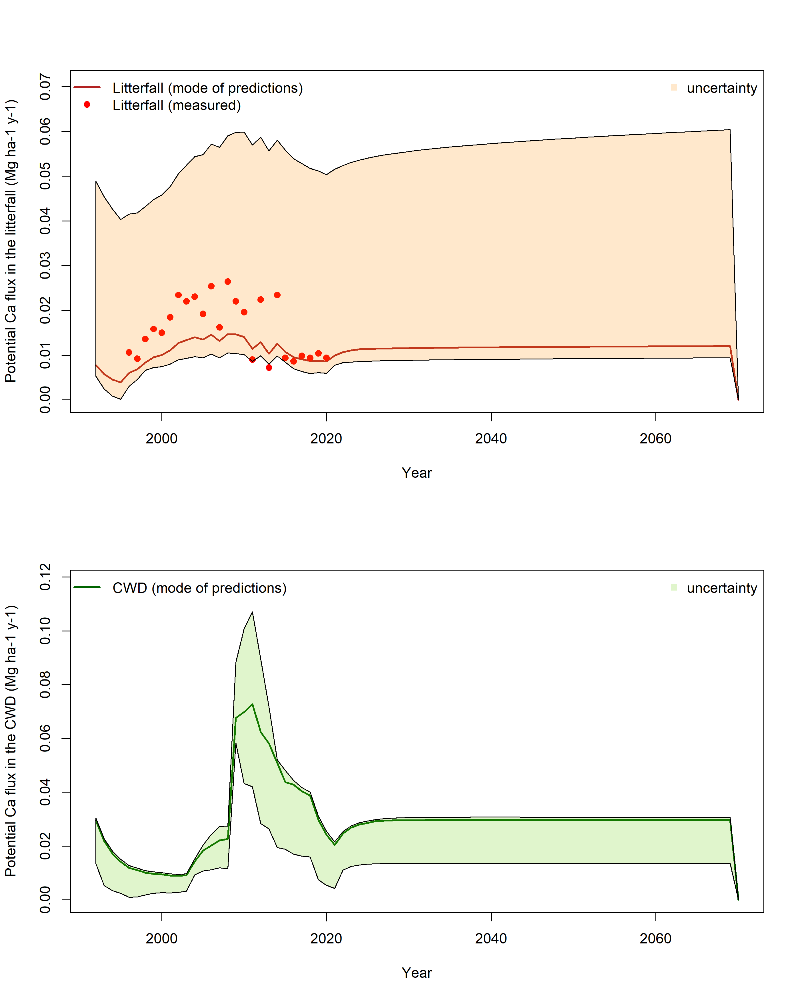

```{r setup, include=FALSE}
knitr::opts_chunk$set(echo = TRUE)
```


Aim: [Scandinavian Journal of Forest Research](https://www.tandfonline.com/toc/sfor20/current), short communication.

>**short communications**

>Should be written with the following elements in the following order: title page; abstract; keywords; main text introduction, materials and methods, results, discussion; acknowledgments; declaration of interest statement; references; appendices (as appropriate); table(s) with caption(s) (on individual pages); figures; figure captions (as a list)
Should be no more than 4000 words, inclusive of the abstract, tables, references, figure captions.
Should contain an unstructured abstract of 200 words.
Should contain between 3 and 7 keywords. Read making your article more discoverable, including information on choosing a title and search engine optimization.
Short communications aim to provide rapid dissemination of preliminary, but significant (timely, novel) results. They may report limited data sets or novel ways to apply existing methods or theories. Comments or replies to articles that have been recently published in the journal can also be accepted. Short communications will be given priority in publishing. Contact the editor-in-chief before submitting. Short communications must not exceed 4000 words. The number and size of figures and tables should be limited to two in total, i.e. any combination - two figures, two tables, or one figure and one table. The total number of references must not exceed 10 (ten) for a short communication. Do not use footnotes.


# Abstract

# Keywords

# Introduction
Base cations, and in particular Calcium (Ca), are positively connected with forest fertility but are at the same time highly sensitive to anthropogenic and natural disturbances [@leysNaturalAnthropogenicDrivers2016]. The return time of natural disturbances is closely connected with tree mortality [@pughImportantRoleForest2019] and the consequent flux of Ca resulting from biomass decomposition. Such return time, and therefore the frequency of disturbances, is increasing in both southern Europe and northern Europe (south Sweden and Finland) due to climate change [@neumannClimateVariabilityDrives2017] and a consequent increase in tree mortality, although at the moment not easily predictable, is something to prepare for. Besides the evident effect these mortality events have on the net primary production of forest stands, another possible consequence is the loss of other nutrients associated with the mineralization of huge quantities of organic matter from dead trees.
In the present study we focused on historical Ca dynamics in a southern Sweden monitored forest [@lofgrenRecoverySoilWater2011], representing them with an organic matter decomposition model [@hyvonenDynamicsSoilCa2012] in one of its most recent calibrations specific to coarse dead wood[@menichettiModelingPersistenceCoarse2021]. We utilized the model to understand the contribution of decomposition to Ca mobilization, and consequently on the vulnerability of Ca stocks to both climate change and disturbance events.

# Materials and methods
## The study site

## The model and how it was used
The Q model in its former calibration [@hyvonenPredictingLongTermSoil1998] can represent relatively well the litterfall Ca^++^ fluxes, as in this draft simulation:

The model is driven by littertrap C data measured directly at the site, and by assumptions about CWD data which are representing the annual inputs for the decomposition model. 
### Estimating CWD inputs

## Extending Q to predict potential Ca^++^ mineralization with uncertainty
We can consider the uncertainty of the model predictions by extending forward the uncertainty estimated for Q previously estimated [menichettiModelingPersistenceCoarse2021]. Such calibration produced a set of possible parameter values within a certain confidence interval of predictions (based on the calibration decomposition dataset of the study), and we can assume that the parameter uncertainty will be the same in this case. We can therefore run multiple iterations of the model using the former calibration parameter sets to produce margins of uncertainty.
The terms u0 and tmax are calculated, with an error term added from the model calibration. The maximum tree diameter has been assumed as 13.5 centimeters, from the average of the dataset of the model calibration [@makinenPREDICTINGDECOMPOSITIONSCOTS2006]. The term u0 is calculated from latitude according to @hyvonenPredictingLongTermSoil1998 based on the relationship $u0=0.0855+0.0157*(50.6-0.768*latitude)$. Error terms to these values are added based on the model calibration in @menichettiModelingPersistenceCoarse2021.
The model is run considering only priors from the former calibration, without updating them with new information. This is because there is very little information to constrain the model. It would be possible to use the litterfall Ca^++^ data to update the priors, but then those data would influence the whole calibration and the updated parameter distributions (based on litterfall) would influence also the kinetics of the CWD decomposition. Given the importance of the latter in sudden pulses (which are the most dangerous in terms of Ca^++^ losses), we preferred not to update the calibration since it was based on (and optimized for) CWD kinetics. 
We chose to utilize the generic parameterization from @menichettiModelingPersistenceCoarse2021 instead of the specific ones, in order to have a more generic result. This calibration is based on spruce and pines data, and on both snags and fallen logs. Having calibrated both on snags and logs, which present different kinetics, the calibration presents a bimodal probability distribution for some parameters which reflects sometimes in the bimodal distribution of the results.
We do not have data about the proportions of dead snags or logs in the stand, and we therefore need to rely on this more general calibration rather than specific ones.

## Extending Ca^++^ vulnerability predictions for Aneboda to future climate scenarios

### Calcium content and climate
Calcium content in different tree species is known to be linked with precipitations. We will utilize the relationship expressed in @bergCalciumDecomposingFoliar2017 for linking our modeling results with the climatic projections from SMHI. 

The future climate scenarios will be derived from the average for Sweden produced by SMHI The future climate scenarios will be derived from the average for Sweden produced by SMHI [(https://www.smhi.se/en/climate/future-climate/climate-scenarios/sweden/nation/rcp45/year/precipitation)](https://www.smhi.se/en/climate/future-climate/climate-scenarios/sweden/nation/rcp45/year/precipitation): 

data are reported as \% variation relative to current precipitation, so I chose as a reference level 750 mm MAP as stated in the annual reports.


# Results

## Uncertainty in Ca^++^ mobilization due to organic matter decomposition


## Future Ca vulnerability assuming constant input and climate
First of all we need to assume some future C inputs. For simplicity we assume a conservation scenario, and extend the inputs 50 years in the future by using a mean (of the whole time series):

This produces the following predictions concerning the Ca^++^ ions:


This picture is of course highly dependent on the inputs, in particular the CWD inputs.

When considering instead future climate, we can simulate the effect of the foreseen change in precipitation in the Ca content of the biomass:


## 2.2.1 Future Ca vulnerability assuming constant input and changing climate


We then use these data to drive a new decomposition simulation. We first transform min, max and mean Ca scenarios in a relative variation, and we apply this variation both to the living and dead Ca:C ratio.


The bimodal probability distribution of the litter stocks is probably due to the model calibration used presenting a bimodal distribution for some parameters, which in turns represent different types of dead wood (the different peaks are probably representing different kind of materials with different kinetics, for example snags or logs and of different species. The resulting model ensemble is anyway more robust)


## Future Ca vulnerability in a simulated forest management assuming variable climate and simulated natural disasters
In order to extend the simulation of the potential C losses to a managed forest, we simulated a typical Swedish forest with a semi-empirical growth model [@agrenChangesCarbonStores2003a]. We assumed an average site index for Sweden of 21.7 [@fahlvikEvaluationGrowthFunctions2014] and an average latitude of 60.1, and simulated the biomass growth of a typical clear cut system with thinnings. We assumed that all harvest residuals wer left in place.
We then perturbated such system assuming a single mortality event killing 70% of the trees of the stand, and adapted the sequence of thinnings to match the basal area of the first scenario with natural growth.


# Discussion

## Representing kinetics of Calcium over time
Biomass in a same stand, with stable climatic conditions, has a relatively constant Ca content [@hyvonenDynamicsSoilCa2012] and decomposition of Ca is strictly connected with the decomposition of C. Even results such as in @bergCalciumDecomposingFoliar2017b, unveiling a linear relationship between Ca release rate and initial Ca amount when decomposition starts, are clearly confirming this connection (since the Ca release rate can be directly expressed as the derivative of the Ca stock decomposition, which would therefore follow a first order kinetic quite precisely reproducing their results). This is also confirmed by the relatively good agreement of the Ca content in the litter predicted by our model (which is driven by decomposing C inputs) and the measured.
The Ca^++^ ions once released can be either leeched, absorbed by the soil buffer capacity or be absorbed by new biomass growing. In our case the forest is not growing, and the biomass is reducing due to the reported storms and insect outbreaks.

Biomass is therefore not absorbing Ca, and the newly mobilized Ca^++^ ions are potentially vulnerable for leaching. 
This suggests that, as a consequence of natural stresses such as massive plant deaths caused by storms/outbreaks, the system is losing Ca. This seems confirmed by the Ca content in the stream water from the catchment around a decade after the insect outbreaks following the Gudrun storm.

The lag we observe is probably due to the soil buffer capacity, but ultimately if the biomass does not grow back these events will result in a Ca loss from the system


# Conclusions: estimated sensitivity of Ca stocks to change in climate and to catastrophic events

## 4.1 Estimated sensitivity of Ca stocks to change in climate
Swedish climate is supposed to become more humid, with an increase in mean annual precipitations. The amount of water available for the plants is known to have an effect on the Ca content of the biomass, which in turn determines the Ca flux in the ecosystem. This flux

### 4.2 Estimated sensitivity of Ca stocks to catastrophic events


# References